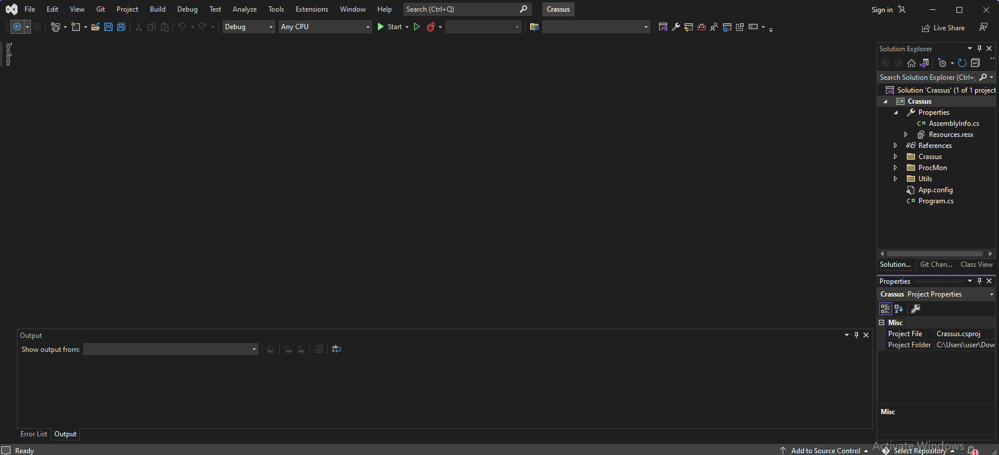
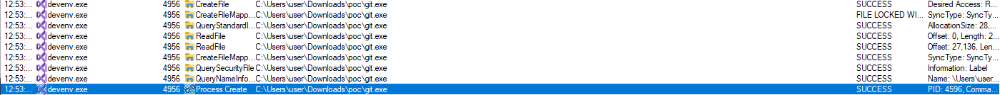
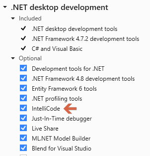
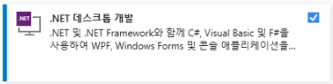

# Visual Studio Remote Code Execution Vulnerability

- [Environment](#environment)
	- [OS](#os)
	- [Visual Studio Version](#visual-studio-version)
	- [Target](#target)
- [devenv.exe Functional analysis](#devenvexe-functional-analysis)
- [Vulnerable 1. Arbitrary Code Execution](#vulnerable-1-arbitrary-code-execution)
- [Case 1. ".NET deskop development" environment is installed.](#case-1-net-deskop-development-environment-is-installed)
- [Case 2. If the development environment is in a different version from the project settings. Alternatively, .NET Desktop Development is not installed.](#case-2-if-the-development-environment-is-in-a-different-version-from-the-project-settings-alternatively-net-desktop-development-is-not-installed)
- [Case 3. Git clone repo](#case-3-git-clone-repo)


## environment
### OS
- Windows 10(x64) 21h2 19044.2486(case1)
- Windows 11(x64) 22h2 22621.1105(case2)

### Visual Studio Version
- Visual Studio Community 2022 17.4.4(case1)
- Visual Studio Community 2022 17.3.3(case2)

### Target
- devenv.exe: You can build, debug, and deploy the Visual Studio project .sin file from the command line to set various options for IDE.
	- C:\Program Files\Microsoft Visual Studio\2022\Community\Common7\IDE\devenv.exe
	- Version 17.3.3
## devenv.exe Functional analysis
#### details
- When a typical user double-clicks .sin, the command is executed and ide is executed as follows.
	- "C:\Program Files\Microsoft Visual Studio\2022\Community\Common7\IDE\devenv.exe" "C:\Users\user\Downloads\poc\Crassus.sln"



## vulnerable 1. Arbitrary Code Execution

- When you use Process monitor to check the logs that appear as the project runs, if there is a program named "git.exe" in the folder where the project file (.sin) is located, run it in devenv.exe.




### details

- Microsoft.VisualStudio.IntelliCode.ni.dll

  - https://learn.microsoft.com/ko-kr/visualstudio/intellicode/overview
  - https://learn.microsoft.com/ko-kr/visualstudio/version-control/git-with-visual-studio?view=vs-2022

- Microsoft.VisualStudio.IntelliCode.ProofOfAccess.Git.RepositoryUtility.FindGitExePath

  - In that function, you can check the code to find the "git.exe" binary location at multiple locations (%PROGRAMW6432%, %PATH%). At this time, git.exe first recognizes the executed project and moves on.

  ```c#
  string text = Path.Combine(new string[]
  	{
  		vsInstallFolder,
  		"CommonExtensions",
  		"Microsoft",
  		"TeamFoundation",
  		"Team Explorer",
  		"Git",
  		"cmd",
  		"git.exe"
  	});
  	if (File.Exists(text))
  	{
  		gitExePath = text;
  		return GitExeLocation.VSGitExe;
  	}
  	string[] array = new string[]
  	{
  		Environment.ExpandEnvironmentVariables("%PROGRAMW6432%"),
  		Environment.ExpandEnvironmentVariables("%PROGRAMFILES%"),
  		Environment.ExpandEnvironmentVariables("%PROGRAMFILES(X86)%")
  	};
  	for (int i = 0; i < array.Length; i++)
  	{
  		string text2 = Path.Combine(array[i], "Git", "cmd", "git.exe");
  		if (File.Exists(text2))
  		{
  			gitExePath = text2;
  			return GitExeLocation.StandaloneProgram;
  		}
  	}
  ```

  

  - Microsoft.VisualStudio.IntelliCode.ProofOfAccess.Git.GitProofOfAccessProvider.GetRepositoryIdentifiers

    - The repoRootPath will then be handed over to the git.exe location in the project, causing two commands to be executed. The commands are as follows.
      - git.exe config --get remote.origin.url
      - git.exe remote -v

    ```c#
    ImmutableList<string>.Builder builder = ImmutableList.CreateBuilder<string>();
    			string text = string.Empty;
    			using (Process process = GitProofOfAccessProvider.GitExecute(repoRootPath, "config --get remote.origin.url"))
    			{
    				while (!process.StandardOutput.EndOfStream)
    				{
    					text = process.StandardOutput.ReadLine();
    				}
    				process.WaitForExit(1000);
    				if (!process.HasExited || process.ExitCode != 0)
    				{
    					text = string.Empty;
    				}
    			}
    			if (!string.IsNullOrWhiteSpace(text))
    			{
    				builder.Add(text);
    			}
    			using (Process process2 = GitProofOfAccessProvider.GitExecute(repoRootPath, "remote -v"))
    ```




## Case 1. ".NET deskop development" environment is installed.

- ".NET desktop development" is installed.




https://user-images.githubusercontent.com/52561835/221816149-4a5573b3-2c29-48b9-a14f-4bcf0cd549e2.mp4


## Case 2. If the development environment is in a different version from the project settings. Alternatively, .NET Desktop Development is not installed.

- - If the version of .net and the version of the pc that runs are different when a project was created, it is triggered through a version downgrade.
  - "Update the target to .NET Framework 4.8 (Recommended)" check box-> Continue button


https://user-images.githubusercontent.com/52561835/221816092-426b3298-47f5-460e-8462-0181ac079e12.mp4


## Case 3. Git clone repo

- Code executed at the same time as clone.


https://user-images.githubusercontent.com/52561835/221815903-8ac0459f-4ced-494d-b2f6-f358ffeb940e.mp4


